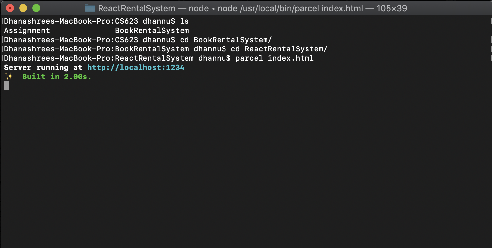
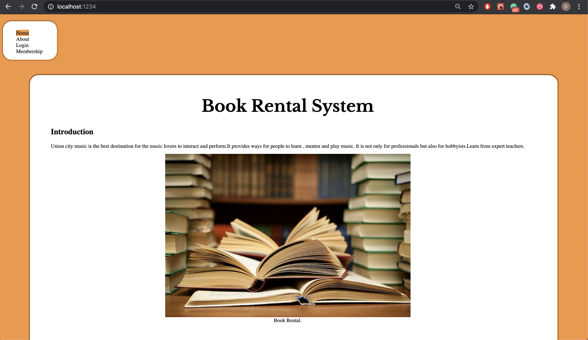

# BookRentalSystem

- fork BookRentalSystem
- `install npm install -g parcel-bundler` outside main repo
- install inside `npm install --save react react-dom` inside BookRentalSystem/ReactRentalSystem/
- to run the react app use `parcel index.html` and get the loacalhost adress and open it in the web browser

### functionalities 

- Guest
home, about, login are implemented 
- To login as admin - admin@email.org
- To login as member - member@email.org

- Admin
home, EditBooks(add, remove) , logout, about implemented

- member 
home, about, booklist, logout 

